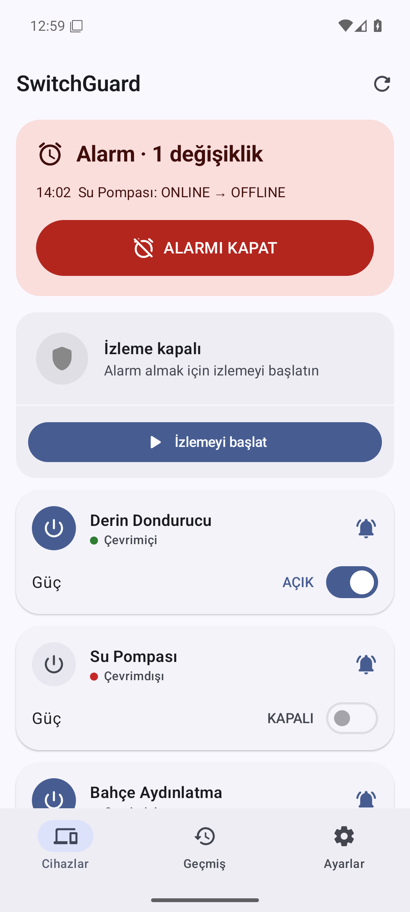
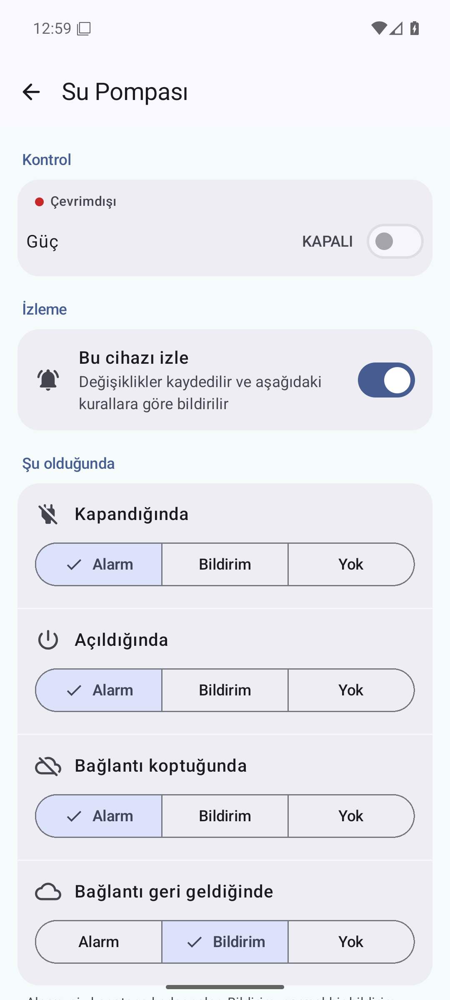
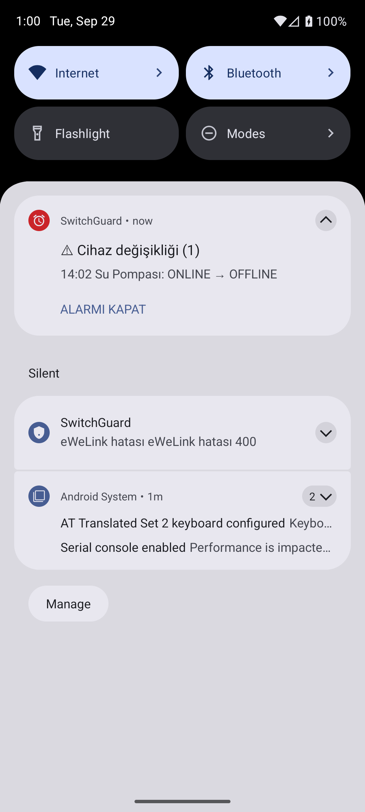

# SwitchGuard

Android app that watches the smart plugs and switches in your own **eWeLink / SONOFF** account and rings a real alarm the moment something changes — a pump that stopped, a freezer plug switched off, a device that lost its connection.

*Türkçe: eWeLink hesabınızdaki SONOFF priz ve anahtarları izler; kapandığında, açıldığında ya da bağlantısı koptuğunda siz kapatana kadar çalan bir alarm verir.*

<p>
  
  
  
</p>

## Features
- Alarm that keeps ringing until dismissed, even in silent mode; a different sound per device
- Live updates over the eWeLink WebSocket, with HTTP resync and polling fallback
- Per-device rules (alarm / notification / ignore) for off, on, offline and online
- Offline grace period, quiet hours, remote on/off, eWeLink device timers, automations
- Energy readings for power-metering devices, daily summary, full event history
- Loud warning when the eWeLink session is lost (e.g. same account signed in on another phone)
- Free for 1 device; a one-time Pro purchase on Google Play monitors all devices
- No server, no analytics, no ads — everything stays on the phone ([privacy policy](https://sites.google.com/view/switchguard-privacy))

## Requirements
- Android 8.0+ (API 26)
- A free eWeLink developer app (App ID + App Secret) from [dev.ewelink.cc](https://dev.ewelink.cc) — the in-app guide walks you through it
- eWeLink allows one session per account and App ID: give each phone its own eWeLink account and share the devices from the eWeLink app

## Build
```
./gradlew assembleDebug          # debug APK
./gradlew testDebugUnitTest      # unit tests
```
Release builds need a `keystore.properties` + keystore in the project root (not in the repo).

## Setup guides / Kurulum rehberleri
- eWeLink (SONOFF): [English](docs/guide/ewelink.en.md) · [Türkçe](docs/guide/ewelink.tr.md)
- Tuya / Smart Life: [English](docs/guide/tuya.en.md) · [Türkçe](docs/guide/tuya.tr.md)

## Changelog / Sürüm geçmişi
[English](CHANGELOG.md) · [Türkçe](CHANGELOG.tr.md) · [Releases](https://github.com/Macerce/switchguard/releases)

## Contact
Questions, bug reports and feedback: **switchguardapp@gmail.com** (or open an issue here).

## License
[GPL-3.0](LICENSE). SwitchGuard is an independent project and is not affiliated with eWeLink, CoolKit or ITEAD.
