# SwitchGuard – eWeLink (SONOFF) setup guide

[Türkçe](ewelink.tr.md) · [Tuya / Smart Life guide](tuya.en.md)

This guide connects the SONOFF and other eWeLink-compatible devices you control in the **eWeLink** app to SwitchGuard, step by step. It takes about **2–5 minutes** and is free.

SwitchGuard talks to your devices through eWeLink's official API. For that you create **your own free app** (App ID + App Secret) on the eWeLink developer site. You sign in on eWeLink's own page; SwitchGuard never sees your password.

## Video walkthrough (50 s)

Watch every step in a short video (on-screen captions in Turkish): [open on YouTube](https://youtu.be/jK_KcG2OPao)

> **You need:** the eWeLink account your devices are in, and SwitchGuard. A computer is easier for the developer site, but a phone works too.

---

## 1. Open the eWeLink developer site

1. Go to **https://dev.ewelink.cc**.
2. Click **Login/Register** (top right) and sign in with **the eWeLink account your devices are in** (the same email/phone and password as in the eWeLink app).

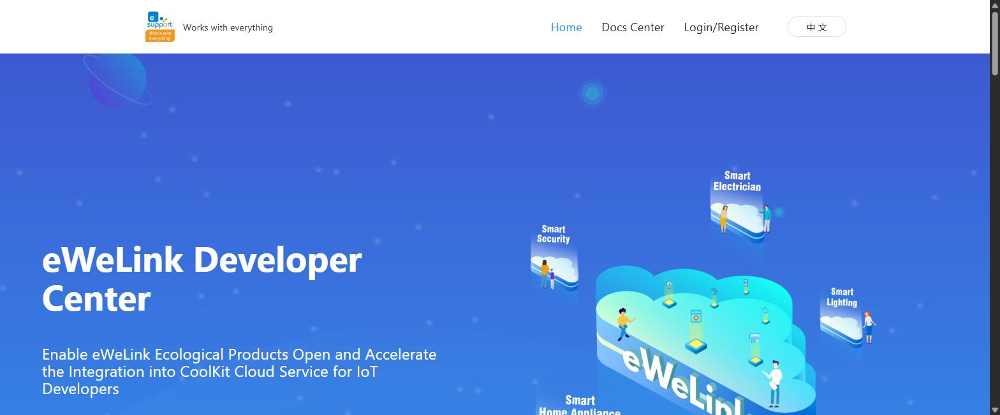

3. After signing in, **Console** appears in the top menu; click it.

### If your account isn't a developer yet (new accounts)

New eWeLink accounts **are not registered as developers**. On **My center → Account Settings** you'll see *Account Identity: Ordinary users* and *Certification Status: Unverified*; until that changes you can't create an app in the Console.

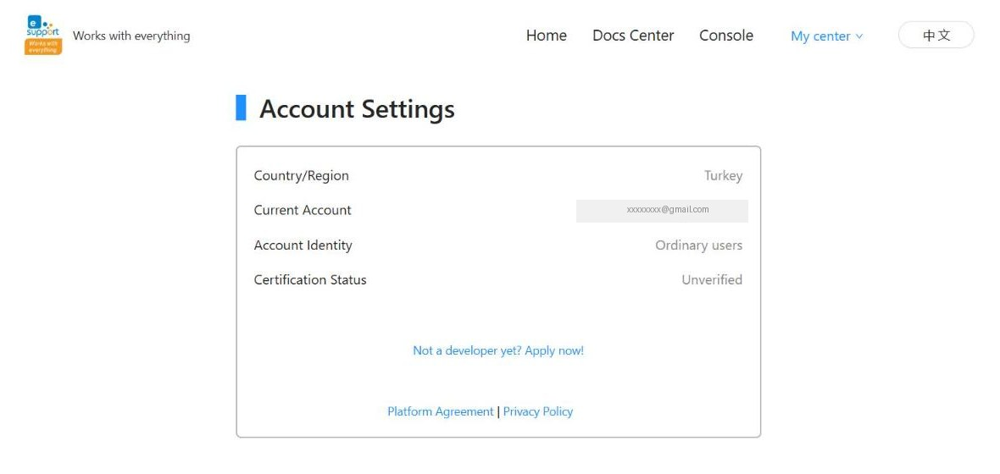

1. Click **Not a developer yet? Apply now!**
2. Choose **Individual developers**.

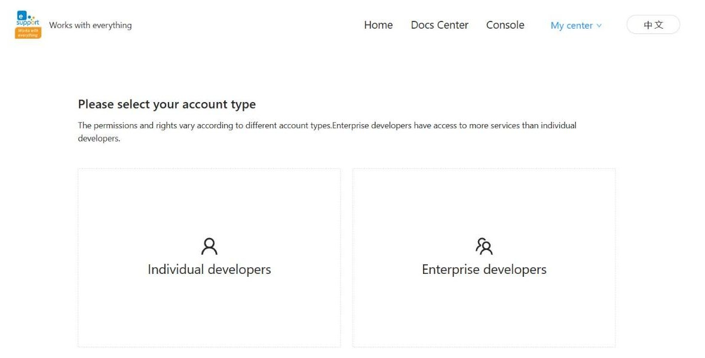

3. Fill in **Name**, **E-mail** and **Occupation** → **Submit**.

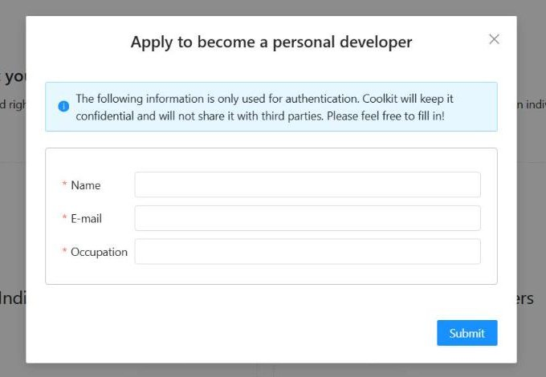

4. **eWeLink has to approve your application.** You can't continue with step 2 until it's approved; after approval your account becomes a developer and you can create an app in the Console.

> **The second eWeLink account you create for extra devices (tablet, TV) does NOT need to be a developer.** The API keys (App ID and App Secret) come from your first, developer account and are the same on every device; the second account is only for signing in on that device (see [Using several devices](#using-several-devices-phone-tablet-android-tv)).

## 2. Create an app

1. On the **App List** page click **Create** (top right).

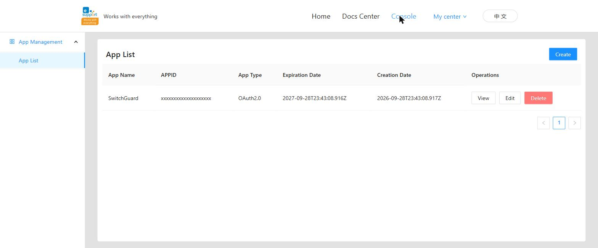

2. Fill in the form:

| Field | What to enter |
|---|---|
| **App Name** | `SwitchGuard` (any name) |
| **App Profile** | a short description, e.g. `SwitchGuard alarm` |
| **App Type** | **OAuth2.0** |
| **App Role** | **Standard Role** (free) |
| **Redirect URL** | `https://127.0.0.1` — must match **exactly** (no trailing `/`, `https`) |

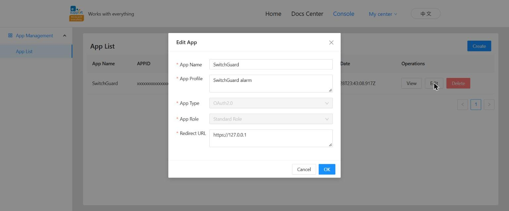

3. Click **OK**. The app appears in the **App List**.

> **The Redirect URL matters:** if the one in SwitchGuard and the one here are not identical, the sign-in page shows an error. SwitchGuard's default is `https://127.0.0.1`; the **Copy Redirect URL** button in setup copies it.
>
> **If nothing happens when you click Create:** the free standard role appears to allow a single app. If you already have one in the list, use it and set its Redirect URL to `https://127.0.0.1` with **Edit**.

## 3. Copy the App ID and App Secret

1. In the **App List** click **View** on your app's row.
2. Under **Authorization Key** copy the **APPID**.
3. Click the **eye** icon next to **APP SECRET** to reveal it, then copy it.

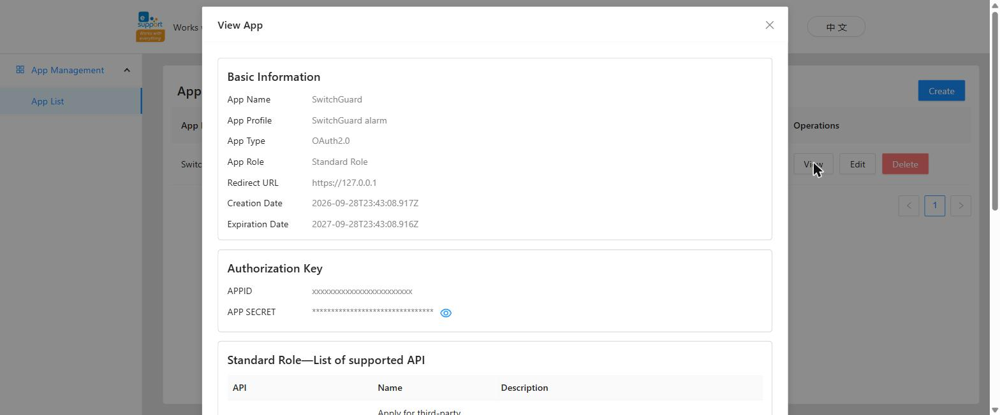

> Treat these two like a password; don't share them.
>
> **The app is valid for 1 year.** Before its **Expiration Date**, renew it on the developer site or create a new one and update the App ID/Secret in SwitchGuard (Settings → Account → API credentials).

## 4. Enter them in SwitchGuard

**During first setup:** at **Where are your devices?** choose **eWeLink** → **Next**.

| Choose eWeLink | Developer app step |
|---|---|
| 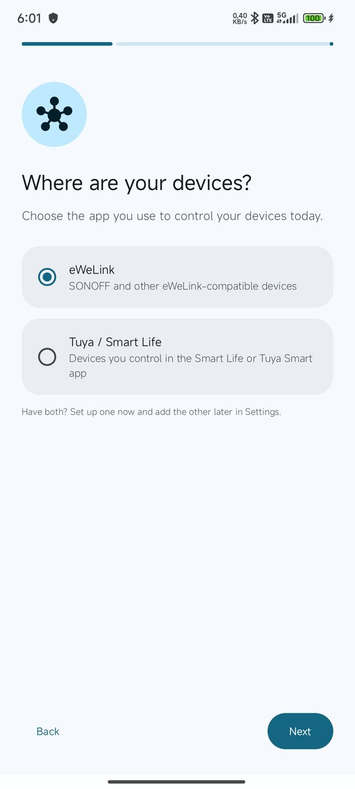 | 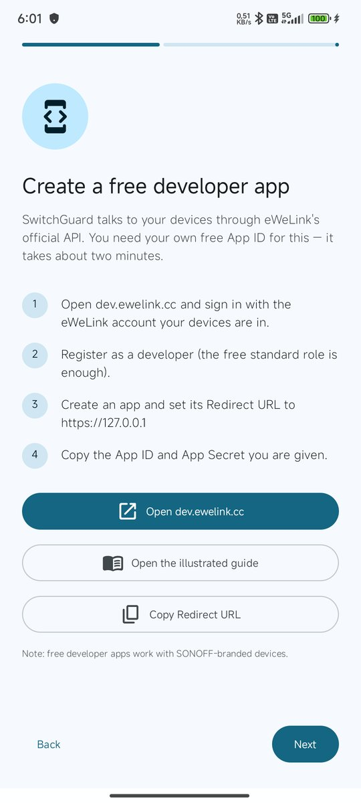 |

**Open dev.ewelink.cc** opens the site; **Copy Redirect URL** copies `https://127.0.0.1`.

**Next** → **Enter your API credentials**:

1. **App ID:** paste the APPID from step 3.
2. **App Secret:** paste the App Secret.
3. **Redirect URL:** must be identical to the developer site (default `https://127.0.0.1`).

**Next** → **Sign in to eWeLink** → tap **Sign in with eWeLink**. eWeLink's own sign-in page opens; use your email/phone and password. When it works it says **"Signed in"**.

| API credentials | Sign in |
|---|---|
| 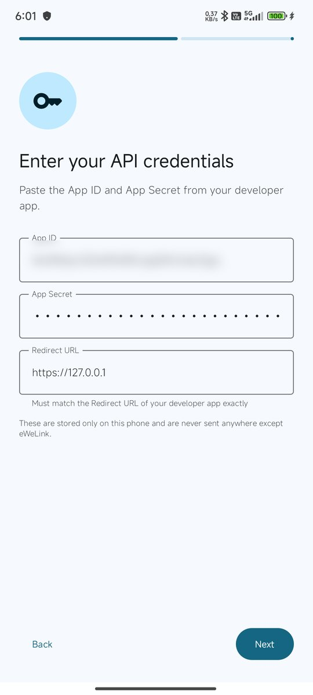 | 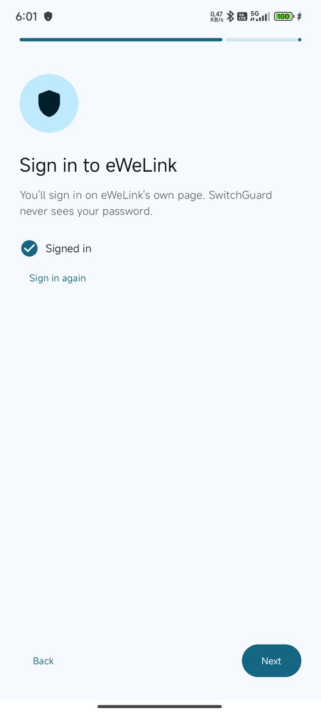 |

**Next** → grant permissions (notifications, background activity) → **Start monitoring**.

**To change later:** **Settings → Account → API credentials** (App ID/Secret) and **Sign in again**.

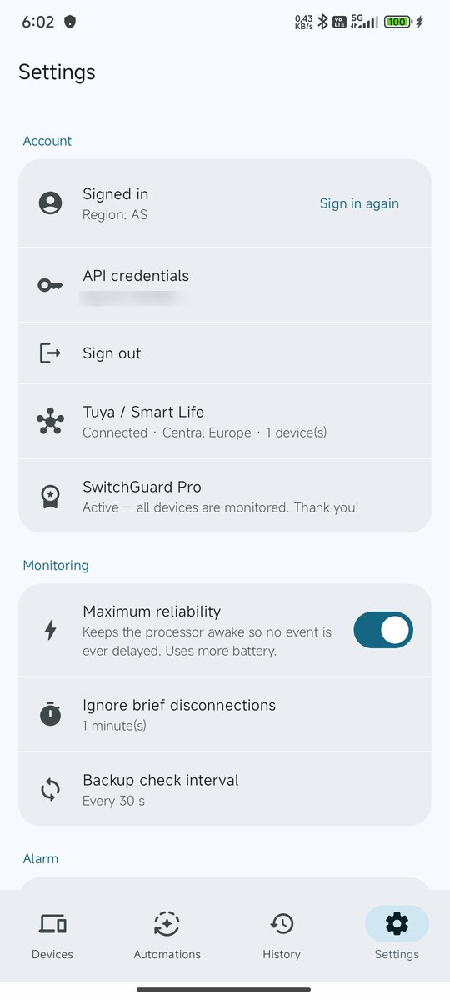

---

## Using several devices (phone, tablet, Android TV)

> **Android TV support and "Send to another device" are coming** in an update. The account rule below already applies to phones and tablets.

- **The API keys (App ID and App Secret) must be the SAME on every device, but the eWeLink account must be DIFFERENT on each device.**
- eWeLink allows a signed-in session on only **one** device per account. Signing in on a second device with the same account signs the first one out (SwitchGuard warns you loudly when that happens).
- For each extra device, create a separate account **in the eWeLink app** (eWeLink's sign-in page has no sign-up; this account doesn't need a developer application) and share your devices with it in the eWeLink app (**device → Share**).
- **Transferring the setup (coming soon):** on the phone **Settings → Send to another device**, on the TV/tablet **Transfer from another device**. Both must be on the same Wi-Fi; enter the 6-digit code shown on the TV. API keys, Tuya keys, rules, automations and settings are sent inside your home network, encrypted with the code; the eWeLink session is not transferred.
- **Signing in on a TV:** easiest is **Login by QR code** at the bottom of eWeLink's sign-in page — scan it with the eWeLink app signed in to the account you created for that device. The remote works too; the keyboard in the Google TV app on your phone is easier.
- **SwitchGuard Pro** is bought once and works on all your devices (phone, tablet, TV) with the same Google account.
- **Alarm on Android TV (coming soon):** the alarm appears full screen on top of whatever is playing (YouTube, TV…) and is dismissed with the remote's OK button.

## Troubleshooting

| Symptom | Fix |
|---|---|
| The sign-in page shows a "redirect" / "invalid" error | Is the Redirect URL **exactly** the same on both sides? (`https://127.0.0.1`, no trailing `/`, `https` not `http`.) |
| Signed in but no devices | Did you sign in to the developer site and SwitchGuard with **the account your devices are in**? Is the region right? |
| Signing in on another phone signs the first one out ("Monitoring stopped — signed out" warning) | eWeLink allows one session per account. Give the second phone **its own eWeLink account** and **share** the devices to it from the eWeLink app. |
| Status card stays **"Monitoring (periodic)"** | Live connection may be unavailable for some App IDs; SwitchGuard keeps watching with regular checks. Adjust the frequency in Settings → **Backup check interval**. |

---

Questions? **switchguardapp@gmail.com** · [GitHub Issues](https://github.com/Macerce/switchguard/issues)
