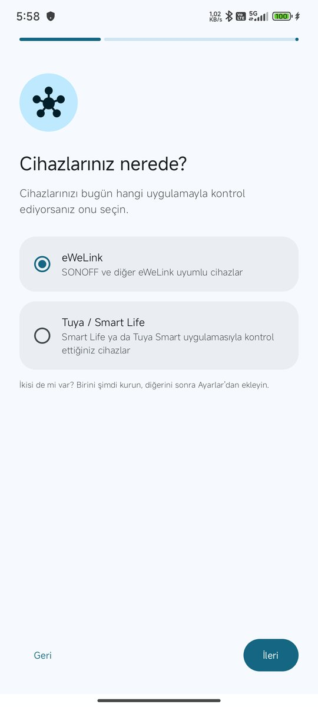
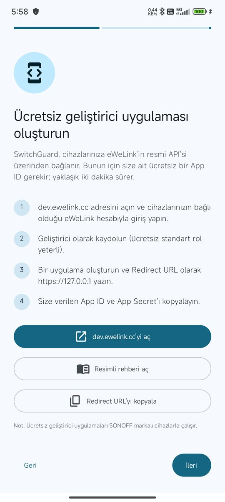
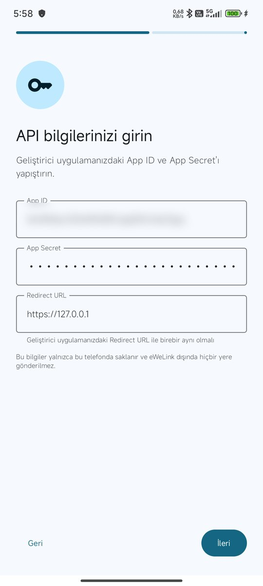
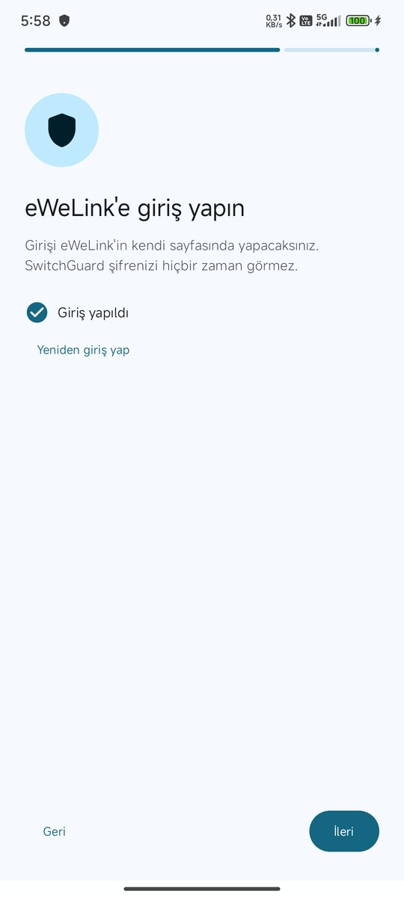
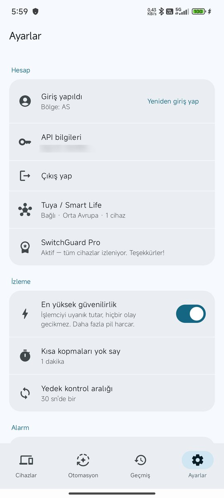

# SwitchGuard – eWeLink (SONOFF) kurulum rehberi

[English](ewelink.en.md) · [Tuya / Smart Life rehberi](tuya.tr.md)

Bu rehber, **eWeLink** uygulamasıyla kontrol ettiğiniz SONOFF ve diğer eWeLink uyumlu cihazları SwitchGuard'a bağlamayı adım adım anlatır. Yaklaşık **2–5 dakika** sürer ve ücretsizdir.

SwitchGuard cihazlarınıza eWeLink'in resmi API'si üzerinden bağlanır. Bunun için eWeLink geliştirici sitesinde **size ait ücretsiz bir uygulama** (App ID + App Secret) oluşturacaksınız. Girişinizi eWeLink'in kendi sayfasında yaparsınız; SwitchGuard şifrenizi hiçbir zaman görmez.

## Videolu anlatım (50 sn)

Tüm adımları kısa bir videoda izleyin: [YouTube'da aç](https://youtu.be/jK_KcG2OPao)

> **İhtiyacınız olanlar:** cihazlarınızın bulunduğu eWeLink hesabı, SwitchGuard. Geliştirici sitesi için bilgisayar daha rahattır ama telefonla da yapılabilir.

---

## 1. eWeLink geliştirici sitesine girin

1. **https://dev.ewelink.cc** adresini açın.
2. Sağ üstteki **Login/Register**'a basın ve **cihazlarınızın bulunduğu eWeLink hesabıyla** giriş yapın (eWeLink uygulamasındaki e-posta/telefon ve şifre).

3. Giriş yapınca üst menüde **Console** belirir; ona basın.

## 2. Uygulama oluşturun

1. **App List** sayfasında sağ üstteki **Create** düğmesine basın.

2. Açılan formu şöyle doldurun:

| Alan | Ne yazılacak |
|---|---|
| **App Name** | `SwitchGuard` (istediğiniz bir ad) |
| **App Profile** | kısa bir açıklama, ör. `SwitchGuard alarm` |
| **App Type** | **OAuth2.0** |
| **App Role** | **Standard Role** (ücretsiz) |
| **Redirect URL** | `https://127.0.0.1` — **birebir aynı** olmalı (sonunda `/` yok, `https`) |

3. **OK**'e basın. Uygulama **App List**'te görünür.

> **Redirect URL çok önemli:** SwitchGuard'daki Redirect URL ile buradaki birebir aynı olmazsa giriş sayfası hata verir. SwitchGuard'daki varsayılan değer `https://127.0.0.1`'dir; kurulum ekranındaki **Redirect URL'yi kopyala** düğmesiyle kopyalayabilirsiniz.
>
> **Create'e basınca bir şey olmuyorsa:** ücretsiz standart rolde tek uygulama oluşturulabiliyor görünüyor. Listede zaten bir uygulamanız varsa onu kullanın; **Edit** ile Redirect URL'sini `https://127.0.0.1` yapın.

## 3. App ID ve App Secret'ı alın

1. **App List**'te uygulamanızın satırındaki **View**'a basın.
2. **Authorization Key** bölümünde **APPID**'yi kopyalayın.
3. **APP SECRET** yanındaki **göz** simgesine basıp görünür yapın ve kopyalayın.

> Bu iki bilgi bir şifre gibidir; kimseyle paylaşmayın.
>
> **Uygulamanın süresi 1 yıldır.** **Expiration Date** tarihinden önce geliştirici sitesinden yenileyin ya da yeni bir uygulama oluşturup SwitchGuard'daki App ID/Secret'ı güncelleyin (Ayarlar → Hesap → API bilgileri).

## 4. SwitchGuard'a girin

**İlk kurulumda:** **Cihazlarınız nerede?** adımında **eWeLink**'i seçin → **İleri**.

| eWeLink'i seçin | Geliştirici uygulaması adımı |
|---|---|
|  |  |

Bu adımdaki **dev.ewelink.cc'yi aç** düğmesi siteyi açar, **Redirect URL'yi kopyala** da `https://127.0.0.1`'i panoya kopyalar.

**İleri** → **API bilgilerinizi girin**:

1. **App ID:** 3. adımda kopyaladığınız APPID'yi yapıştırın.
2. **App Secret:** App Secret'ı yapıştırın.
3. **Redirect URL:** geliştirici sitesine yazdığınızla birebir aynı olmalı (varsayılan `https://127.0.0.1`).

**İleri** → **eWeLink'e giriş yapın** → **eWeLink ile giriş yap**'a basın. eWeLink'in kendi giriş sayfası açılır; e-posta/telefon ve şifrenizle girin. Başarılı olunca **"Giriş yapıldı"** yazar.

| API bilgileri | Giriş |
|---|---|
|  |  |

**İleri** → izinleri verin (bildirim, arka planda çalışma) → **İzlemeyi başlat**.

**Sonradan değiştirmek için:** **Ayarlar → Hesap → API bilgileri** (App ID/Secret) ve **Yeniden giriş yap**.

---

## Birden fazla cihazda kullanım (telefon, tablet, Android TV)

> **Android TV desteği ve "Başka cihaza aktar" yakında** bir güncellemeyle gelecek. Aşağıdaki hesap kuralı telefon ve tablet için bugün de geçerlidir.

- **API anahtarları (App ID ve App Secret) tüm cihazlarda AYNI olmalıdır; eWeLink hesabı ise her cihazda FARKLI olmalıdır.**
- eWeLink, aynı hesapla yalnızca **bir** cihazda oturum açılmasına izin verir. Aynı hesapla ikinci bir cihazda giriş yaparsanız ilk cihazın oturumu kapanır (SwitchGuard bunu yüksek sesli bir uyarıyla bildirir).
- Her ek cihaz için **eWeLink uygulamasından** ayrı bir hesap açın (eWeLink'in giriş sayfasında kayıt seçeneği yoktur) ve cihazlarınızı eWeLink uygulamasında **cihaz → Paylaş** ile o hesapla paylaşın.
- **Kurulumu aktarma (yakında):** Telefonda **Ayarlar → Başka cihaza aktar**, TV/tablette **Başka bir cihazdan aktar**. İki cihaz aynı Wi-Fi'da olmalı; TV'de görünen 6 haneli kodu telefona girersiniz. API anahtarları, Tuya bilgileri, kurallar, otomasyonlar ve ayarlar ev ağınız içinde, kodla şifrelenerek aktarılır; eWeLink oturumu aktarılmaz.
- **TV'de giriş:** en kolayı, eWeLink giriş sayfasının altındaki **Login by QR code** seçeneğidir — QR kodu, o cihaz için açtığınız hesapla giriş yapılmış eWeLink uygulamasıyla okutun. Kumandayla da giriş yapılabilir; telefonunuzdaki Google TV uygulamasının klavyesiyle yazmak daha kolaydır.
- **SwitchGuard Pro** bir kez satın alınır ve aynı Google hesabıyla tüm cihazlarınızda (telefon, tablet, TV) geçerlidir.
- **Android TV'de alarm (yakında):** alarm, o an açık olan her şeyin (YouTube, kanal…) üstüne tam ekran çıkar ve kumandanın OK tuşuyla susturulur.

## Sorun giderme

| Belirti | Çözüm |
|---|---|
| Giriş sayfası "redirect" / "invalid" hatası veriyor | Redirect URL iki tarafta **birebir** aynı mı? (`https://127.0.0.1`, sonda `/` yok, `http` değil `https`.) |
| Giriş başarılı ama cihaz yok | Geliştirici sitesine ve SwitchGuard'a **cihazların bulunduğu hesapla** mı girdiniz? Bölge doğru mu? |
| Başka bir telefonda aynı hesapla giriş yapınca ilk telefon çıkış yapıyor ("İzleme durdu — oturum kapandı" uyarısı) | eWeLink her hesap için tek oturuma izin verir. İkinci telefon için **ayrı bir eWeLink hesabı** açın ve cihazları eWeLink uygulamasından o hesapla **paylaşın**. |
| Durum kartı **"İzleniyor (periyodik)"** kalıyor | Bazı App ID'lerde anlık bağlantı kapalı olabilir; SwitchGuard bu durumda düzenli kontrolle izlemeye devam eder. Ayarlar'daki **Yedek kontrol aralığı** ile sıklığı ayarlayabilirsiniz. |

---

Sorunuz mu var? **switchguardapp@gmail.com** · [GitHub Issues](https://github.com/Macerce/switchguard/issues)
