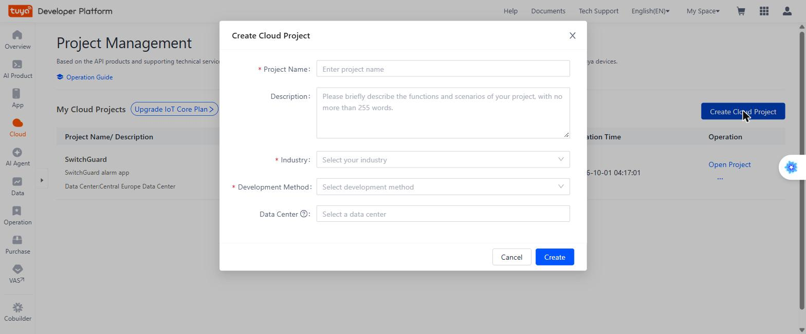
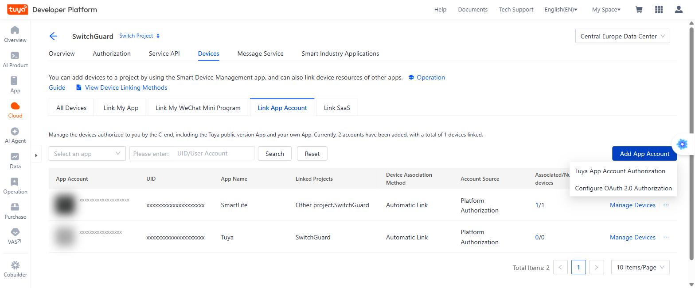
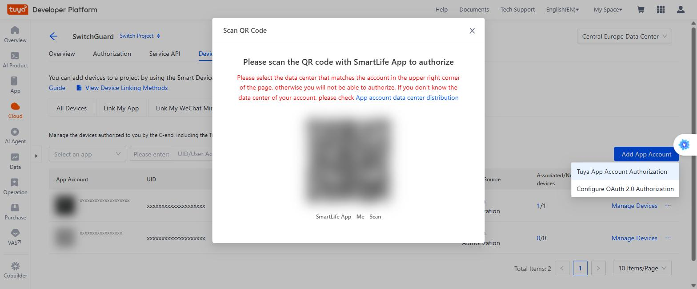
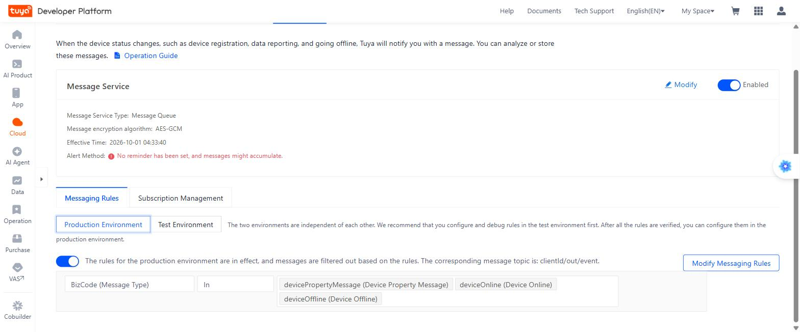
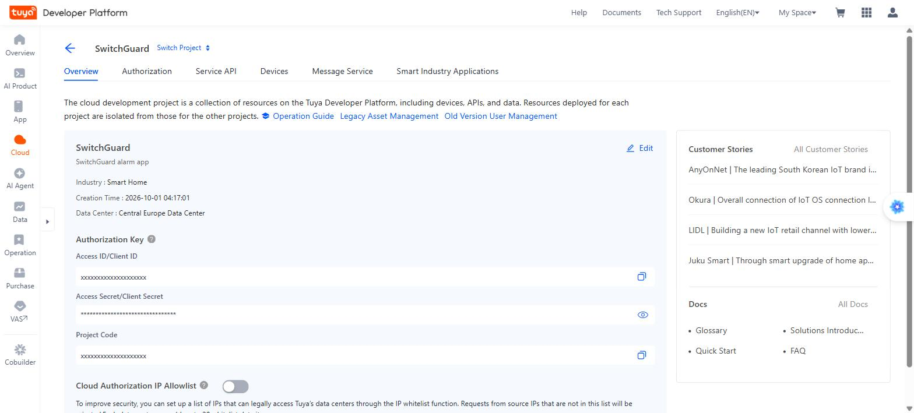
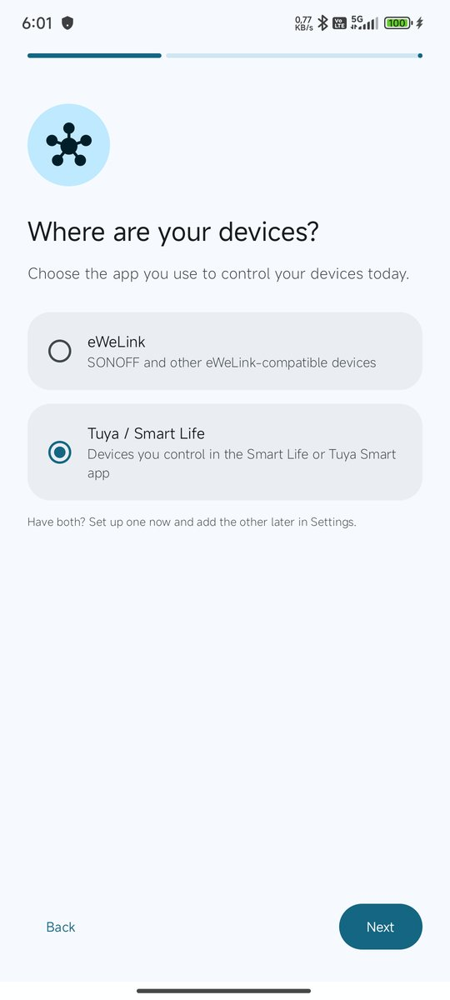
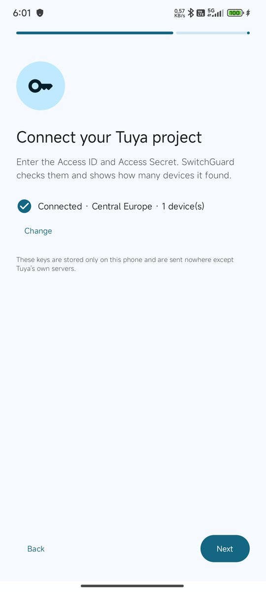
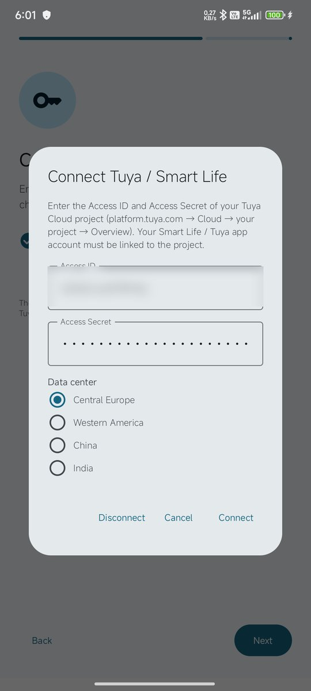

# SwitchGuard – Tuya / Smart Life setup guide

[Türkçe](tuya.tr.md) · [eWeLink guide](ewelink.en.md)

This guide connects the devices you control in the **Smart Life** or **Tuya Smart** app to SwitchGuard, step by step. It takes about **5–10 minutes** and is free.

SwitchGuard reads your devices through Tuya's official cloud API using **your own free Tuya Cloud project**. So first you create a project and link your Smart Life account to it.

## Video walkthrough (1 min)

Watch every step in a short video (on-screen captions in Turkish): [open on YouTube](https://youtu.be/sCdvMs7CSic)

> **You need:** a computer (the Tuya website is hard to use on a phone), a phone with the Smart Life / Tuya Smart app, and SwitchGuard.

---

## 1. Create a Tuya developer account

1. On a computer, go to **https://platform.tuya.com**.
2. **Sign Up / Register** a free account (email + verification code). Account type **Individual** is enough.
3. Sign in.

> This developer account is **separate** from your Smart Life account. Which devices you get is decided by the **Smart Life account** that scans the QR code in step 3, not by this account.

## 2. Create a Cloud project

1. In the left menu open **Cloud** → **Development**.
2. Click the blue **Create Cloud Project** button (top right).
3. Fill in the form:

| Field | What to enter |
|---|---|
| **Project Name** | `SwitchGuard` (any name) |
| **Description** | can be left empty |
| **Industry** | **Smart Home** |
| **Development Method** | **Smart Home** |
| **Data Center** | The region of your Smart Life account. **Europe and Türkiye: Central Europe Data Center** |

4. Click **Create**. On the **API services** page that follows, change nothing and click **Authorize**.

> **The data center matters.** If it is wrong, your devices will not show up. In Smart Life see **Me → Settings → Account and Security → Region**.

## 3. Link your Smart Life account to the project

1. In the project open the **Devices** tab, then **Link App Account**.
2. Click **Add App Account** and choose **Tuya App Account Authorization**.

3. A QR code appears.

4. On your phone open **Smart Life** → **Me** tab → **scan** icon (top right) → scan the code → **Confirm login**.
5. If asked for a mode, keep **Automatic Link** and **Read, Write and Manage**.
6. Your account appears in the list; **Associated/Number of devices** shows how many devices were linked.

> If some devices are in the **Tuya Smart** app, repeat with that app too; both accounts can be linked to the same project.
>
> **Devices that were only "shared" with you may not appear.** Ask the owner to add you as a home member in Smart Life (**Me → Home Management → Add Member**).
>
> One Smart Life account can be linked to at most **2 projects**.

## 4. Turn on live updates (Message Service)

Without this step SwitchGuard still works, but only sees changes **every few minutes**. It is needed for alarms within seconds.

1. Open the project's **Message Service** tab.
2. Switch on **Message Service**. In the dialog:
   - **Message Service Type:** Message Queue (leave as is)
   - **Message Build-Up Alert:** can stay off
   - **Message encryption algorithm:** **AES-GCM** (recommended)
   - Click **OK**.
3. Below, choose **Messaging Rules** → **Production Environment** → **Create Messaging Rules**.
4. Click **Add Message Filtering Rule**. The rule is **BizCode (Message Type) — In**; pick these three values:
   - `devicePropertyMessage` (on/off, power, level and other values)
   - `deviceOnline` (device connected)
   - `deviceOffline` (device disconnected)
5. Click **Release Rule**.
6. **⚠ The step most people miss:** after the rule is saved, **switch ON the toggle** to its left. It should then say *"The rules for the production environment are in effect…"*.

## 5. Copy the Access ID and Access Secret

1. Open the project's **Overview** tab.
2. Copy the **Access ID/Client ID** with its copy icon.
3. On **Access Secret/Client Secret** click the **eye** icon to reveal it, then copy it.

> Treat these two like a password; don't share them.

## 6. Enter them in SwitchGuard

**During first setup:** at **Where are your devices?** choose **Tuya / Smart Life** → **Next** → guide → **Next** → **Enter Access ID and Secret**.

**To add later:** **Settings → Account → Tuya / Smart Life**.

| Choose Tuya in setup | Connect step | Enter the keys |
|---|---|---|
|  |  |  |

1. Paste the **Access ID** and **Access Secret** from step 5.
2. **Data center:** the one you chose for the project (Europe/Türkiye: **Central Europe**).
3. Tap **Connect**. SwitchGuard tests them and shows **"Tuya connected: N device(s) found"**.

Your devices now appear on the **Devices** screen, in the same list as eWeLink devices.

---

## Troubleshooting

| Symptom | Fix |
|---|---|
| "Tuya rejected the Access ID / Secret" | Copy them again (no spaces at the start/end) and make sure the **data center** matches the project. |
| "0 devices found" | Check step 3: is the account linked, in the right data center? For shared devices, become a home member. |
| Status card stays **"Monitoring (periodic)"**, alarms arrive minutes late | Is the messaging rule **toggle ON** (step 4)? Is the rule in the Production environment? |
| "Tuya Cloud trial has expired" notification | Tuya's free plan is time-limited. Extend it at **platform.tuya.com → Cloud → Cloud Services / IoT Core → Extend Trial Period** (short form, usually approved within minutes). It can be extended up to 6 months at a time; extend again when it runs out. |
| Using the same keys on two phones, one gets late alerts | Tuya's message service delivers live messages to only **one** phone per project. Create a separate Tuya project for each phone (one Smart Life account can be linked to at most 2 projects). |

### About quotas

The free plan includes about **26,000 API calls** and **68,000 messages** per month. SwitchGuard paces itself: it checks every 15 minutes when live updates work and every 5 minutes when they don't. That is plenty for a handful of devices.

---

Questions? **switchguardapp@gmail.com** · [GitHub Issues](https://github.com/Macerce/switchguard/issues)
