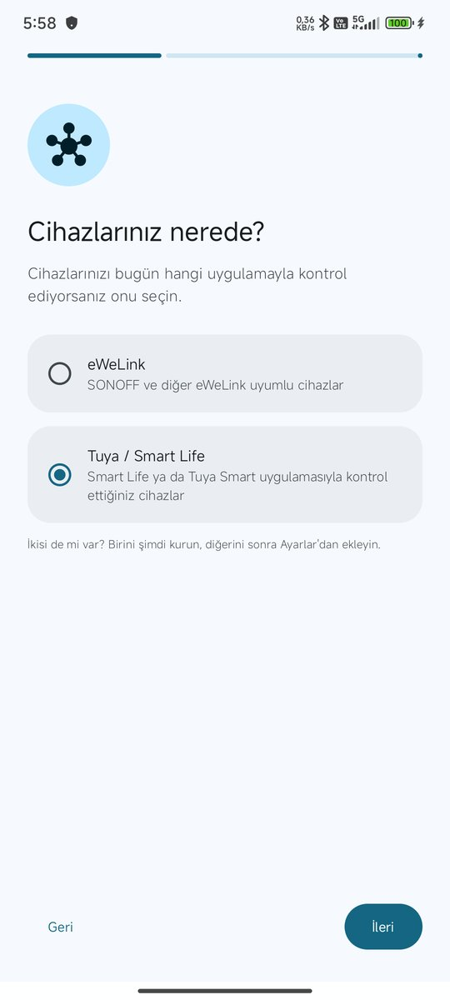
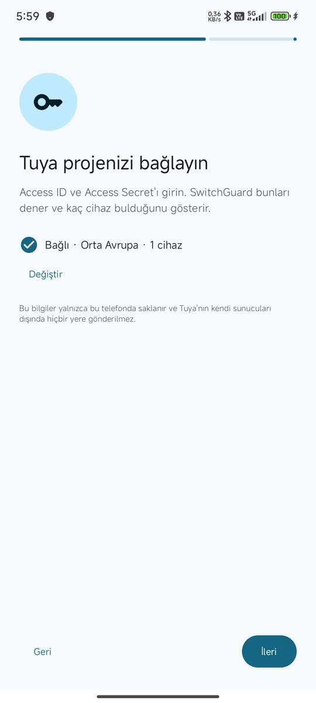
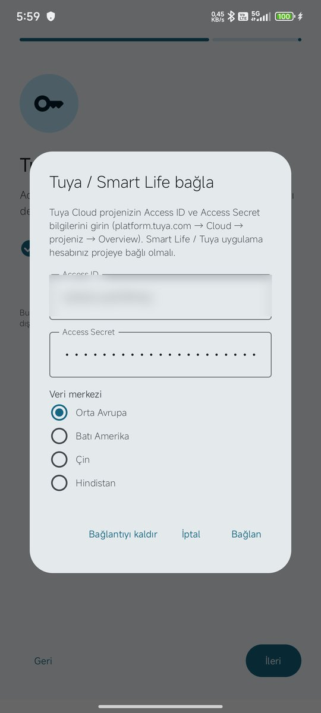

# SwitchGuard – Tuya / Smart Life kurulum rehberi

[English](tuya.en.md) · [eWeLink rehberi](ewelink.tr.md)

Bu rehber, **Smart Life** ya da **Tuya Smart** uygulamasıyla kontrol ettiğiniz cihazları SwitchGuard'a bağlamayı adım adım anlatır. Toplam süre yaklaşık **5–10 dakikadır**. Hepsi ücretsizdir.

SwitchGuard cihazlarınıza Tuya'nın resmi bulut API'si üzerinden, **size ait ücretsiz bir Tuya Cloud projesiyle** bağlanır. Bu yüzden önce bir proje açıp Smart Life hesabınızı ona bağlayacaksınız.

## Videolu anlatım (1 dk)

Tüm adımları kısa bir videoda izleyin: [YouTube'da aç](https://youtu.be/sCdvMs7CSic)

> **İhtiyacınız olanlar:** bir bilgisayar (Tuya sitesi telefonda zor kullanılır), Smart Life / Tuya Smart uygulaması yüklü telefon, SwitchGuard.

---

## 1. Tuya geliştirici hesabı açın

1. Bilgisayarda **https://platform.tuya.com** adresine gidin.
2. **Sign Up / Register** ile ücretsiz hesap açın (e-posta + doğrulama kodu). Hesap türü olarak **Individual (Bireysel)** yeterlidir.
3. Giriş yapın.

> Bu geliştirici hesabı Smart Life hesabınızdan **ayrıdır**. Hangi cihazların görüneceğini bu hesap değil, 3. adımda QR kodu okutacağınız **Smart Life hesabı** belirler.

## 2. Cloud projesi oluşturun

1. Soldaki menüden **Cloud** → **Development** sayfasını açın.
2. Sağ üstteki mavi **Create Cloud Project** düğmesine basın.
3. Formu şöyle doldurun:

| Alan | Ne yazılacak |
|---|---|
| **Project Name** | `SwitchGuard` (istediğiniz bir ad) |
| **Description** | boş bırakılabilir |
| **Industry** | **Smart Home** |
| **Development Method** | **Smart Home** |
| **Data Center** | Smart Life hesabınızın bölgesi. **Türkiye ve Avrupa için: Central Europe Data Center** |

4. **Create**'e basın. Ardından çıkan **API servisleri** sayfasında hiçbir şeyi değiştirmeden **Authorize**'a basın.

> **Veri merkezi önemli.** Yanlış seçilirse cihazlarınız görünmez. Smart Life uygulamasında **Ben → Ayarlar → Hesap ve Güvenlik → Bölge** kısmından hesabınızın bölgesini görebilirsiniz.

## 3. Smart Life hesabınızı projeye bağlayın

1. Projenin içinde üstteki **Devices** sekmesini, ardından **Link App Account** sekmesini açın.
2. Sağdaki **Add App Account** düğmesine basın ve menüden **Tuya App Account Authorization**'ı seçin.

3. Ekrana bir QR kod gelir.

4. Telefonda **Smart Life** uygulamasını açın → **Ben** sekmesi → sağ üstteki **tarama** simgesi → QR kodu okutun → **Girişi onayla**.
5. Pencerede yetki modu sorulursa **Automatic Link** ve **Read, Write and Manage** seçili kalsın.
6. Listede hesabınız görünür; **Associated/Number of devices** sütunu kaç cihazın bağlandığını gösterir.

> Cihazlarınızın bir kısmı **Tuya Smart** uygulamasındaysa aynı işlemi o uygulamayla da yapın; iki hesap aynı projeye bağlanabilir.
>
> **Size yalnızca "paylaşılmış" cihazlar görünmeyebilir.** Cihaz sahibinden sizi Smart Life'ta **Ben → Ev Yönetimi → Üye Ekle** ile evine üye olarak eklemesini isteyin.
>
> Bir Smart Life hesabı en fazla **2 projeye** bağlanabilir.

## 4. Anlık bildirimleri açın (Message Service)

Bu adım yapılmazsa SwitchGuard çalışır ama değişiklikleri **ancak birkaç dakikada bir** görür. Alarmın saniyeler içinde gelmesi için gereklidir.

1. Projede **Message Service** sekmesini açın.
2. **Message Service** yanındaki anahtarı açın. Çıkan pencerede:
   - **Message Service Type:** Message Queue (değiştirmeyin)
   - **Message Build-Up Alert:** kapalı kalabilir
   - **Message encryption algorithm:** **AES-GCM** (önerilen)
   - **OK**'a basın.
3. Aşağıda **Messaging Rules** → **Production Environment** seçin → **Create Messaging Rules**.
4. **Add Message Filtering Rule**'a basın. Kural **BizCode (Message Type) — In** olarak gelir; değer listesinden şu üçünü seçin:
   - `devicePropertyMessage` (açma/kapama, güç, seviye gibi değerler)
   - `deviceOnline` (cihaz bağlandı)
   - `deviceOffline` (cihaz koptu)
5. **Release Rule**'a basın.
6. **⚠ En çok unutulan adım:** kural kaydedildikten sonra solundaki **anahtarı açın.** Yanında *"The rules for the production environment are in effect…"* yazmalı.

## 5. Access ID ve Access Secret'ı alın

1. Projede **Overview** sekmesini açın.
2. **Access ID/Client ID** satırındaki kopyala simgesiyle Access ID'yi kopyalayın.
3. **Access Secret/Client Secret** satırında **göz** simgesine basıp görünür yapın ve kopyalayın.

> Bu iki bilgi bir şifre gibidir; kimseyle paylaşmayın.

## 6. SwitchGuard'a girin

**İlk kurulumda:** **Cihazlarınız nerede?** adımında **Tuya / Smart Life**'ı seçin → **İleri** → rehber adımı → **İleri** → **Access ID ve Secret gir**.

**Sonradan eklemek için:** **Ayarlar → Hesap → Tuya / Smart Life**.

| Kurulumda Tuya'yı seçin | Bağlantı adımı | Bilgileri girin |
|---|---|---|
|  |  |  |

1. **Access ID** ve **Access Secret** kutularına 5. adımda kopyaladıklarınızı yapıştırın.
2. **Veri merkezi:** projeyi açarken seçtiğiniz merkez (Türkiye/Avrupa: **Orta Avrupa**).
3. **Bağlan**'a basın. SwitchGuard bilgileri dener ve **"Tuya bağlandı: N cihaz bulundu"** yazar.

Cihazlarınız artık **Cihazlar** ekranında, eWeLink cihazlarıyla aynı listede görünür.

---

## Sorun giderme

| Belirti | Çözüm |
|---|---|
| "Tuya, Access ID / Secret bilgisini kabul etmedi" | Bilgileri yeniden kopyalayın (başta/sonda boşluk olmasın) ve **veri merkezinin** projeyle aynı olduğundan emin olun. |
| "0 cihaz bulundu" | 3. adımı kontrol edin: hesap projeye bağlı mı, doğru veri merkezinde mi? Paylaşılan cihazlar için ev üyesi olun. |
| Durum kartı **"İzleniyor (periyodik)"** kalıyor, alarmlar dakikalar sonra geliyor | 4. adımdaki mesaj kuralının **anahtarı açık mı**? Kural Production ortamında mı? |
| "Tuya Cloud deneme süresi doldu" bildirimi | Tuya'nın ücretsiz planı süreli. **platform.tuya.com → Cloud → Cloud Services / IoT Core → Extend Trial Period** ile uzatın (kısa bir form; onay genelde dakikalar içinde gelir). En fazla 6 ay uzatılabilir; süre bitince tekrar uzatın. |
| İki telefonda aynı bilgileri kullanınca biri geç bildirim alıyor | Tuya'nın mesaj servisi bir projeye bağlanan telefonlardan yalnızca **birine** anlık mesaj gönderir. Her telefon için ayrı bir Tuya projesi açın (aynı Smart Life hesabı en fazla 2 projeye bağlanabilir). |

### Kota hakkında

Ücretsiz plan ayda yaklaşık **26.000 API çağrısı** ve **68.000 mesaj** içerir. SwitchGuard çağrıları buna göre ayarlar: anlık bildirim açıkken 15 dakikada bir, kapalıyken 5 dakikada bir kontrol yapar. Birkaç cihaz için kota fazlasıyla yeter.

---

Sorunuz mu var? **switchguardapp@gmail.com** · [GitHub Issues](https://github.com/Macerce/switchguard/issues)
